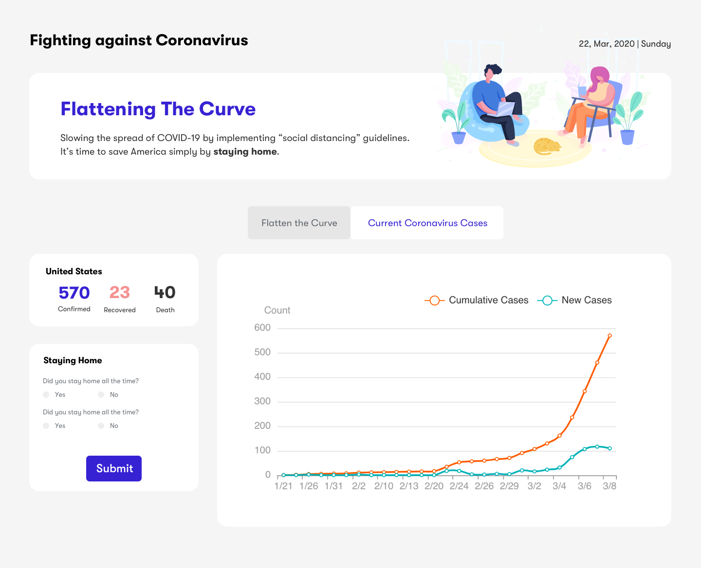
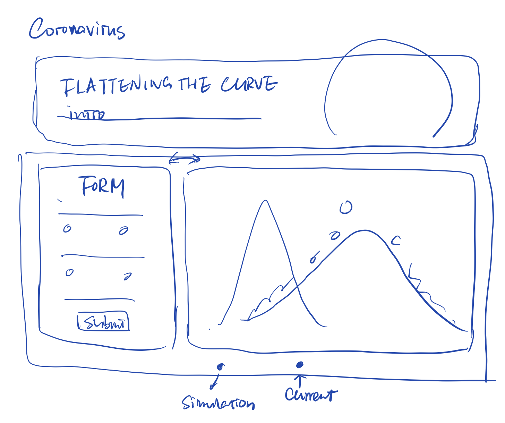
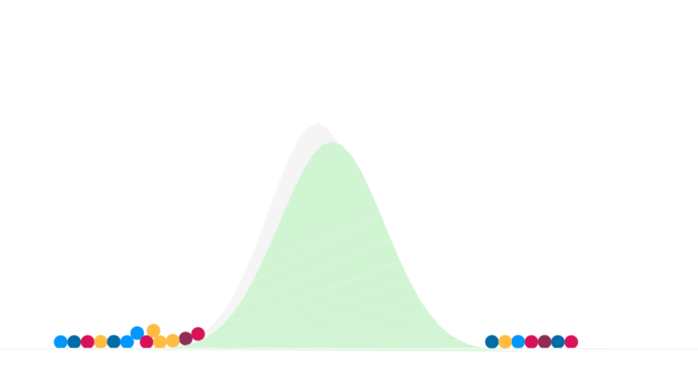
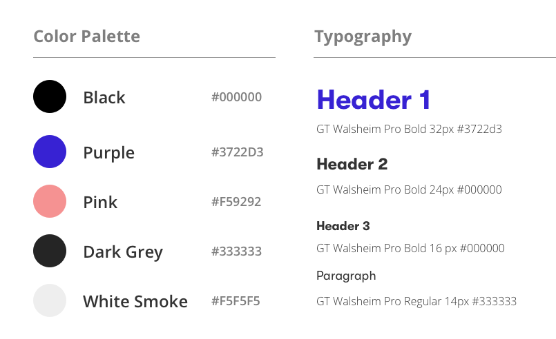
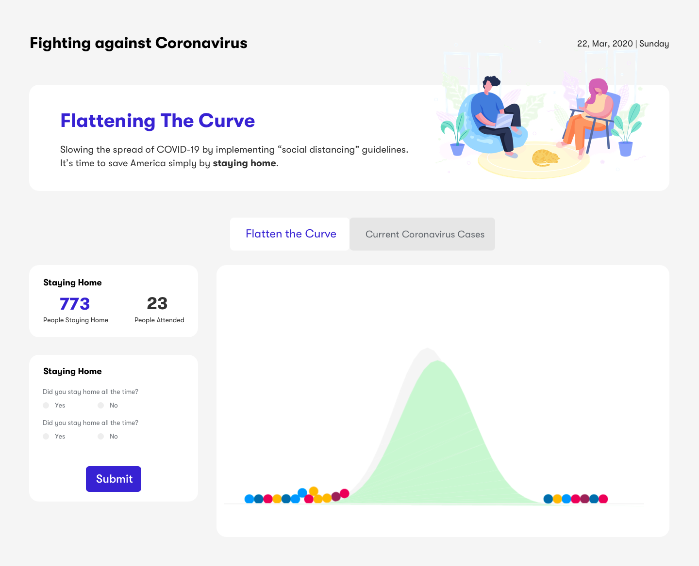

# Fighting against Coronavirus

Real-time Coronavirus data dashboard & Live demo of how "socila distancing" flattens the curve. [Live Website](https://rebeccazhou666-final-dwd.glitch.me/) clicks here.
See video demo is here.

# About
It's a dashboard that allows users to monitor the current coronavirus situation and also provide a fun place for people to see the impact of "social distancing" on the spread of coronavirus.   
It really helps to flatten the curve of coronavirus spread by simply <strong>staying HOME</strong>. 
 Data source from [1point3acres](https://coronavirus.1point3acres.com/en).

# Prerequisites & Installation
Clone or Download this repo to run the project.  
If you want to set it up by your own, you need to download node and dependencies to run the project. Follow [this guide](https://github.com/itp-dwd/2020-spring/blob/master/guides/installing-nodejs.md) to install node.js. And also install the following dependencies.  

<strong>Installing Dependencies in Terminal</strong> (Mac)
~~~ 
npm install NeDB // install nedb database
npm install express // install express.js
npm install cheerio //Install cheerio to run JQuery-like syntax
npm install superagent //Install superagent to crawl data from website.
npm install node-schedule // install node-schedule to execute function in a given time
npm install poly-decomp // install poly-decomp to decomp curves to accessible shape in Matter.js
npm install webpack // solve rendering problems for Matter.js on server.js
~~~

# Reqirements
1. Dashboard-like interface.
2. Real-time coronavirus data(line chart), interactive and straight-forward curve flattening demo based on the level of social distancing
4. Form to ask for the behavior of social distancing.

# Design
The sketch is as below.

 
To prove the feasibility of demo part. I spent an afternoon, trying to find the right tool to draw the interactive curve-flattening demo. I searched online starting from Dan Shiffman's "The Coding Train" and got inspired by his intro to <strong>Matter.js</strong> and dug further.
The reason that I used the original engine and render in Matter.js instead of combining [p5.js](https://p5js.org/) is that the coordination system between Matter.js and p5.js is different. p5.js used top-left as starting point while Matter.js used center, which made rendering calculation more complex, especially for irregular shapes and curves. 
Only when I saw the demo worked can I make sure that this feasibility was positive.

  
Then I designed hi-fi sketch.

# Development
<h3>About Front-End Development</h3>

This time I tried `Tabs + Grid` combination to arrange the contents, which brought some difficulties. The problem I still had was that I wanted to keep the current selected tab on page reload. I tried `Bootstrap 3` to track the `location.hash` but it didn't execute the `$(window).on("popstate", function())` when I reloaded the page. Will keep debuging it.

<h3>About Matter.js</h3>

I used the inherited rendering so it was not responsive as other elements. To draw the curves of coronavirus spread, I used `Gaussian Distribution` to simulate, which might not be accurate. The initial distribution followed *N ~ (0,1)* The number of people staying home would increase the sigma and shown on the shapes of curve.

<h3>About Data Scrapping</strong></h3>

In node.js, I used `supergeny + cheerio` to crawl data from the website. I developed methods based on [last week's data scrapping](https://github.com/RebeccaZhou666/predict-coronavirus/blob/master/README.md) codes and fixed the update problem by constrain the update in a given time (midnight everyday).
~~~
// data scrapping
function crawlStats(){ 
  superagent.get('https://coronavirus.1point3acres.com/en').end((err, res) => { //  use superagent npm to crawl website
  if (err) {
  } else { 
    stat = getStats(res); 
  }});
}

let getStats = (res) => {  
  let $ = cheerio.load(res.text); // load website and analyze in Jquery syntax
  $('strong.jsx-889234990').each((idx, ele) => { //  the element I crawl, choose strong && .jsx-889234990 
      if(idx < 3) today_stats.push(parseInt($(ele).text())); // the first three data: confirmed, recovered, death.
    });
    console.log(today_stats)
    return today_stats;
};
~~~
~~~
// update data at 0:0:0 everyday
function scheduleCronstyle(){
  schedule.scheduleJob('0 0 0 * * *', function(){ // second, min, hour, day, month, week
      crawlNewData();
  }); 
}
scheduleCronstyle();
~~~
<h3>About Data Visulization</strong></h3>

I used ECharts.js as the tool of data visualization. One thing that need to point out is that the Echarts.js cannot load in a `display:none` element because it is loaded as the page loaded and it won't change its size till next reload. So I had to put the coronavirus data page at the default tab. 

# Deployment

Login Glitch.com, create a new project by cloning from Git Repo, and paste the URL to finish. 
But this time, Glitch shows lots of mistakes which I never see... sigh 

# Reference & Credits
* [COVID-19 Real-time updates](https://coronavirus.1point3acres.com/en)
* [Echarts](https://www.echartsjs.com/en/index.html)
* [normalize.css](https://necolas.github.io/normalize.css/)

## Built with

* [VS Code](https://code.visualstudio.com/)
* [Github](https://github.com)
* [Glitch](https://glitch.com/)

## Author

* [Rebecca Zhou](https://rebeccazhou.net) 
